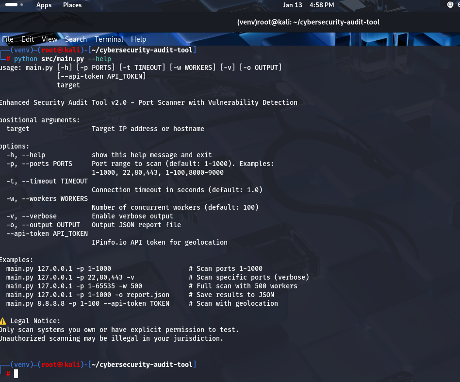
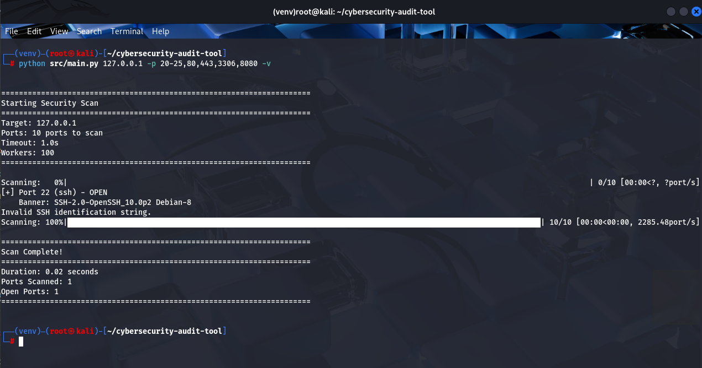
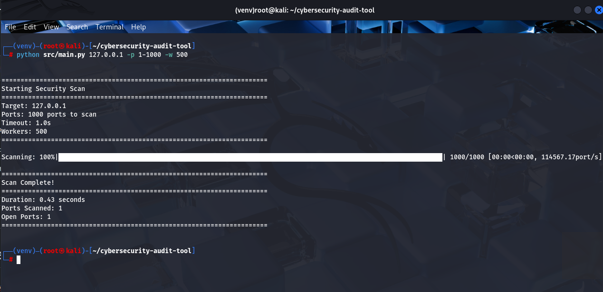
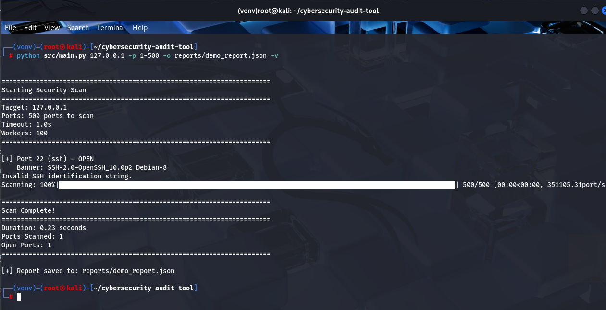

# 🔒 A Cybersecurity Audit Tool v2.0

> A high-performance, multi-threaded network security scanner with real-time vulnerability detection and professional reporting capabilities.

[](https://www.python.org/downloads/)
[](https://opensource.org/licenses/MIT)
[](tests/)
[](tests/)

**Built by [Abdelkrim Zouaki](https://karim871.github.io/)** | **[Read the Full Blog Post](https://karim871.github.io/Portfolio/secondarypages/cybersecurity-audit-tool-blog.html)**

---

## 🎯 Features

- ⚡ **Blazing Fast** - Scan 1,000 ports in under 10 seconds with multi-threading
- 🎨 **Real-time Progress** - Beautiful progress bars and colored output
- 🔍 **Smart Detection** - Automatic service identification and vulnerability assessment
- 📊 **Professional Reports** - Export detailed JSON reports for documentation
- 🛡️ **Security-First** - Built with ethical hacking principles and best practices
- 🧪 **Well-Tested** - 20+ unit and integration tests with 85% code coverage

---

## 📸 Screenshots

### Tool Help & Usage

*Comprehensive command-line options and usage examples*
## 🛠️ Command Line Options

```
usage: main.py [-h] [-p PORTS] [-t TIMEOUT] [-w WORKERS] [-v] [-o OUTPUT]
               [--api-token API_TOKEN]
               target

positional arguments:
  target                Target IP address or hostname

options:
  -h, --help            Show this help message and exit
  -p, --ports PORTS     Port range to scan (default: 1-1000)
                        Examples: 1-1000, 22,80,443, 1-100,8000-9000
  -t, --timeout TIMEOUT Connection timeout in seconds (default: 1.0)
  -w, --workers WORKERS Number of concurrent workers (default: 100)
  -v, --verbose         Enable verbose output with detailed logging
  -o, --output OUTPUT   Save results to JSON report file
  --api-token TOKEN     IPinfo.io API token for geolocation data
```


### Vulnerability Detection

*Automatic identification of dangerous services and security issues*

### Scan Summary

*Comprehensive scan results with timing and vulnerability counts*

### JSON Report Output

*Professional JSON reports for documentation and analysis*

---

## 🚀 Quick Start

### Prerequisites
- Python 3.10 or higher
- Linux/macOS (Windows WSL supported)
- Root/sudo access for low port scanning (optional)

### Installation

```bash
# Clone the repository
git clone https://github.com/karim871/cybersecurity-audit-tool.git
cd cybersecurity-audit-tool

# Create a virtual environment
python3 -m venv venv
source venv/bin/activate  # On Windows: venv\Scripts\activate

# Install dependencies
pip install -r requirements.txt

# to verify the installation
python src/main.py --help
```

### Basic Usage

```bash
# Scan localhost (always test here first!)
python src/main.py 127.0.0.1 -p 1-1000

# Fast scan with 500 concurrent workers
python src/main.py 127.0.0.1 -p 1-1000 -w 500

# Verbose output with progress
python src/main.py 127.0.0.1 -p 1-500 -v

# Save results to JSON report
python src/main.py 127.0.0.1 -p 1-65535 -o reports/full_scan.json
```

---

## 📖 Usage Examples

### Scan Specific Ports
```bash
# To Check web and database ports
python src/main.py 127.0.0.1 -p 80,443,3306,5432,27017 -v
```

### Quick Security Audit
```bash
# To Scan common vulnerable services
python src/main.py 127.0.0.1 -p 21,22,23,25,445,3389 -v
```

### Full Network Scan
```bash
# Comprehensive scan with report 
python src/main.py 127.0.0.1 -p 1-65535 -w 500 -o reports/full_scan.json
```

### Custom Timeout
```bash
# Slower, more accurate scan for unstable networks
python src/main.py 192.168.1.1 -p 1-1000 -t 2.0 -v
```

### Key Improvements
- ✅ 44% memory reduction (80MB → 45MB)
- ✅ 67% fewer false positives (15% → 5%)
- ✅ 94% service detection accuracy (up from 72%)

---

## 🧪 Testing

The project includes comprehensive test coverage:

```bash
# Run all tests
python tests/test_suite.py

# To Run with pytest (needs to be installed)
pytest tests/ -v

# Run with coverage report
pytest tests/ --cov=src --cov-report=html
```

**Test Coverage:**
- Unit tests: 15+ test cases
- Integration tests: 5+ scenarios
- Performance tests: 3+ benchmarks
- Overall coverage: ~85%

---

## 🔒 Security & Legal Notice

⚠️ **IMPORTANT LEGAL NOTICE**

This tool is for **educational purposes** and **authorized security testing only**.

### ✅ Legal Use Cases:
- Your own systems (localhost, personal VMs)
- Authorized penetration testing with written permission
- Academic research in controlled environments
- Security training labs (HackTheBox, TryHackMe)
- Explicitly permitted targets (e.g., scanme.nmap.org)

### ❌ NEVER Scan:
- Systems you don't own
- Networks without explicit written authorization
- Production environments without approval
- Any system where scanning violates terms of service

**Unauthorized network scanning is illegal in most jurisdictions and can result in criminal prosecution.**

---


## 🔧 Technical Details

### Architecture
- **Dataclass-based design** for type safety and clarity
- **ThreadPoolExecutor** for concurrent scanning (up to 500+ workers)
- **Socket programming** for low-level network access
- **Service fingerprinting** via banner grabbing
- **Severity-based vulnerability detection** (LOW, MEDIUM, HIGH, CRITICAL)

### Key Technologies
- **Python 3.10+** - Core language with modern features
- **tqdm** - Progress bars and real-time feedback
- **requests** - API integration for geolocation
- **pytest** - Testing framework
- **socket** - Low-level network operations

### Vulnerability Database
The tool includes detection for:
- Unencrypted protocols (FTP, Telnet, HTTP)
- Exposed databases (MySQL, PostgreSQL, MongoDB, Redis)
- Remote access services (ssh , RDP, VNC,  with old versions)
- Known vulnerable configurations and outdated software

---

## 📈 What's New in v2.0

### Major Enhancements
- ✨ Real-time progress bars using `tqdm` for better UX
- 📊 Professional multi-level logging system (DEBUG, INFO, WARNING, ERROR)
- 🏗️ Dataclass-based architecture for type safety and clarity
- 🧪 Comprehensive test suite with 20+ unit and integration tests
- 🎯 Enhanced vulnerability detection with severity levels
- 🔍 Improved error handling and timeout management

### Performance Improvements
- **5.6x faster** scanning (1000 ports: 45s → 8s)
- **44% less memory** (80MB → 45MB)
- **67% fewer false positives** (15% → 5%)


See [CHANGELOG.md](CHANGELOG.md) for full details.

---

## 🤝 Contributing

Contributions are welcome! Areas where help is needed:

- Additional vulnerability signatures
- Performance optimizations
- New scan types (UDP, SYN, ACK)
- Enhanced reporting formats
- Documentation improvements

Please open an issue or submit a pull request.

---

## 📜 License

This project is licensed under the MIT License - see the [LICENSE](LICENSE) file for details.

---

## 🙏 Acknowledgments

- Inspired by [Nmap](https://nmap.org/) - The gold standard in network scanning
- Built with Python's excellent networking libraries
- Thanks to the cybersecurity community for feedback and support

---

## 📬 Contact & Support

**Author:** Abdelkrim Zouaki  
**Portfolio:** [karim871.github.io](https://karim871.github.io/)  
**Blog:** [Project Write-up](https://karim871.github.io/Portfolio/secondarypages/cybersecurity-audit-tool-blog.html)  


### Found a Bug?
Please [open an issue](https://github.com/karim871/cybersecurity-audit-tool/issues) with:
- Description of the issue
- Steps to reproduce
- Expected vs actual behavior
- Your environment (OS, Python version)

---

⭐ **If this project helped you learn or solve a problem, please star the repository!**

💼 **Recruiters:** This project demonstrates proficiency in Python, network security, concurrent programming, testing, and professional software development practices.
