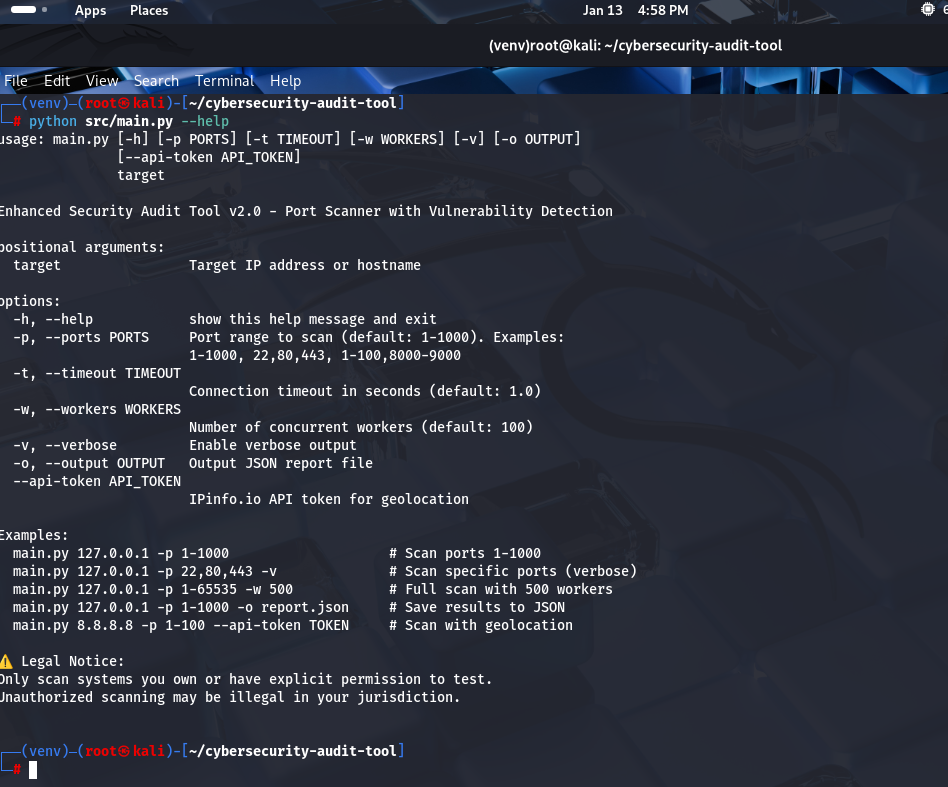
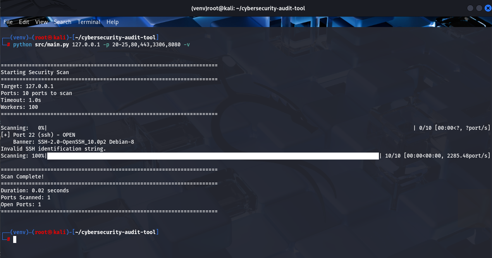
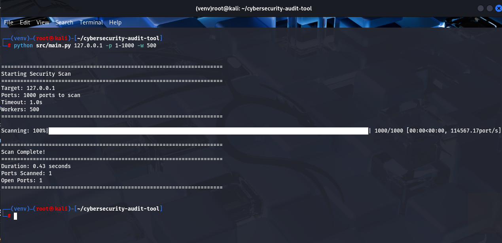
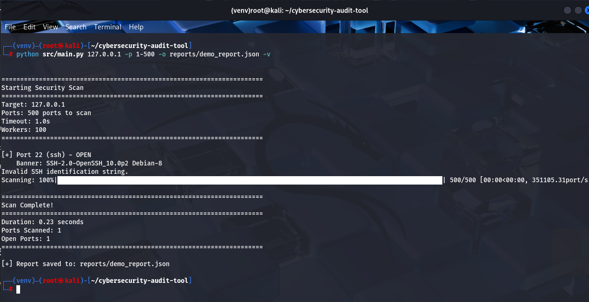

## 📸 Screenshots

### Tool Help & Usage

*Comprehensive command-line options and usage examples*

### Scanning in Action

*Real-time progress tracking with concurrent port scanning*

### Vulnerability Detection

*Automatic identification of dangerous services and security issues*

### Scan Summary

*Comprehensive scan results with timing and vulnerability counts*

### JSON Report Output

*Professional JSON reports for documentation and analysis*
