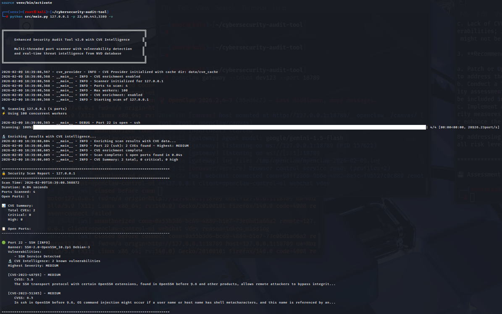
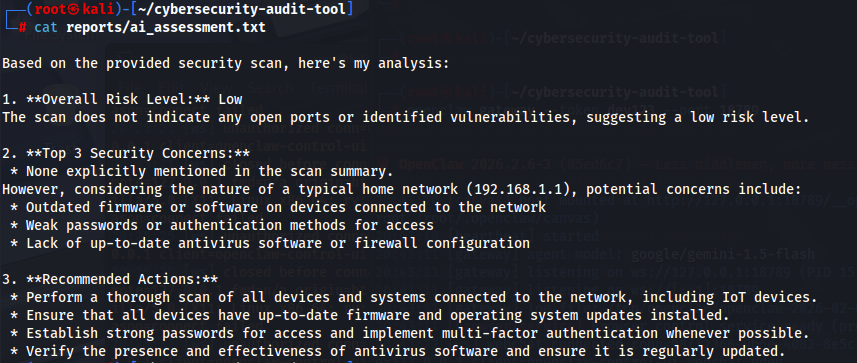
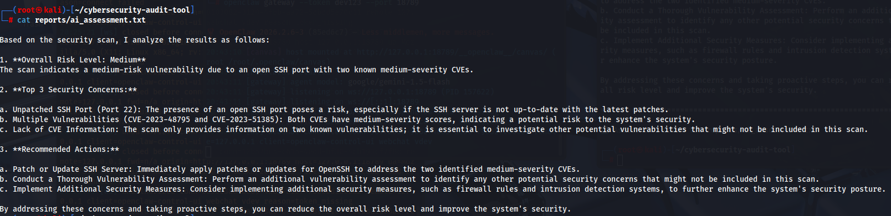
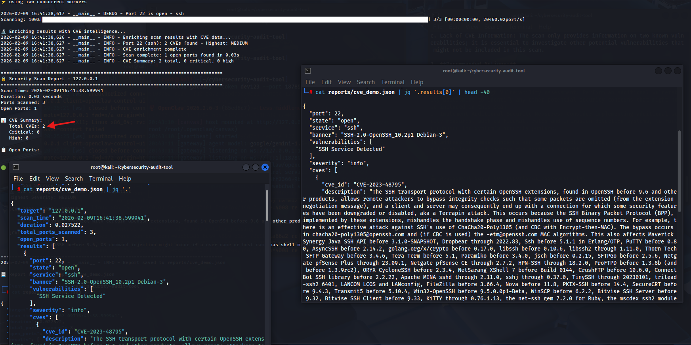
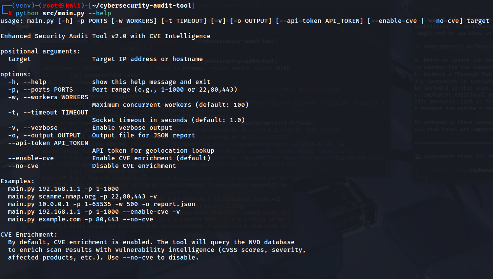

## Screenshots

### Scanning in Action

*Multi-threaded port scan running in real time — 1,000 ports, concurrent workers, live progress*

### AI Security Assessment

*AI-generated risk summary written to `reports/ai_assessment.txt` — overall risk level, top concerns, recommended actions*

### CVE Risk Analysis

*Medium-severity CVE flagged with affected service, version, and remediation context*

### JSON Report with CVE Enrichment

*Structured JSON export with NVD CVE data inline — CVSS scores, descriptions, affected versions*

### CLI Options

*Full command-line reference — port ranges, workers, timeout, CVE toggle, API token, output path*
